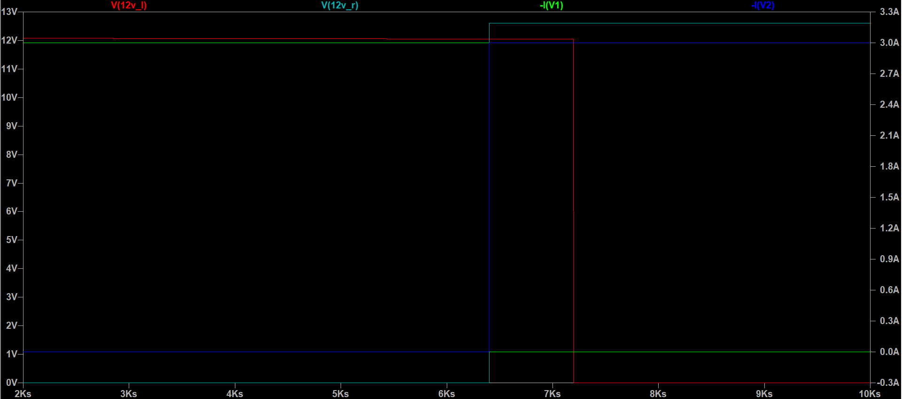
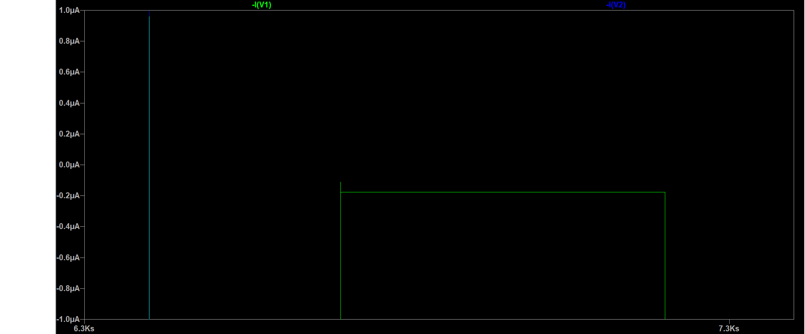

<h1>Summary</h1>
When swapping out the batteries, there will be a short period of time when the new and old batteries are in parallel. This isdangerous because of the lower the %charge of a deep cycle battery, the lower the voltage of the battery, which could lead to a 2 volt difference between the batteries, which would create a short. To avoid this, diodes can be used, along with optional switches.

<h1>Model for Simulation</h1>
For these simulations, the RCT can be modelled as only the battery system and the DC-DC converters. This is because the 12V batteries are connected to 3 things in the actual schematic, the converters, a fuse, and a switch, while all other voltage sources are the DC-DC converters. If the current is not too high, which it shouldn't be in normal operation, the fuse will act as a very weak resistor, which is has such a small impact that it can be ignored. The switch was also ignored, as when the tower is on, the switch should act as an open circuit, meaning it does about as much as the fuse. This only leaves the DC-DC convertes.

DC-DC converters were modelled as 3A current source, which is based off of the maximum fuse current calculated by Aniket. Any higher voltage than this and the fuse would melt, meaning no more than 3A current can be drawn. The batteries were modelled as voltage sources which would decrease until around 50%, which is where you want to stop discharging deep cycle batteries to avoid damaging them. In the simulation, the discharge linearly, when in reality, they would discharge similarly to the graph below, but this should not effect the simulations at all as a linear model would overestimate the voltage difference.

The simulation assumes that battery is running for 2 days (the max amount of time this needs to be powered), dropping by around 1 volt at around 50% charge, before being swapped. At 86.4k seconds (the number of seconds in 1 day), the right (recently charged) battery is placed in parallel, and then shortly afterwards switch connecting the two is turned on. There is around 1000 seconds when both batteries are running, in parallel, which is meant to simulate the time between taking out the old battery and butting in the new. 1000 seconds is incredibly unrealistic, as swapping batteries will take less than a minute, but this is to see if leakage current into the old battery will be significant as time goes on. After this, the left switch is turned off, meaning only the new/right battery is supply power, so the left/old battery can be removed. Below is a graph of the voltages and currents during the switching period. -I(S1) is the left/old battery's current, -I(S2) is the right/new battery's current.

<h1>Simulation Results</h1>
Simulation shows that leakage current of these diodes is very good, as there was only a leakage of 114uA during the 1000 seconds they were in parallel. Actual battery chargers charge at a rate of around 2 to 10 amps, so this is well under this range. Diodes that were used were RB238T-40NZ schottky diodes, which I recommend using these diodes for final design. 

<h1>Thermal Issues</h1>

The information below is just a brief overview of heatsinks, although electrical enclosures will also have to be used. To avoid the high temperatures of the diode melting the plastic wire connectors or the 12 AWG cable, a heat sink is needed for the diode. I recommend [this one](https://www.cuidevices.com/product/resource/hss-b20-np-12.pdf) as it is quite cheap and is able to absorb quite a lot of heat. It also is very easy to attach to the diode, as it just requires a screw. The temperature of the diode needs to be under 100 C to avoid damaging any plastic connectors. The calculation for temperature of a semiconductor is T = Tair + P * ($\theta$jc + $\theta$cs + $\theta$sa), where theta is the thermal resistance of the diode in degrees Celcius/Watts (and the subscripts mean junction to case, case to sink, and sink to air respectively). Power consumed is equal to Vf * I = 0.8 * 3 = 2.4 W at peak current and diode voltage drop. $\theta$ jc is already given, which is 2 C/W. The value of $\theta$cs is not given, but it is typically between 0.5 to 2 C/W depending on the structure of the heat sink, so we can just estimate it as 2 C/W. Finally, the value of $\theta$sa is not given directly, but instead there is a graph in the datasheet of how much the temperature will increase because of the sink based off the wattage, which is at around 31 C. Therefore, the final temperature is 31 + 2.4 * (2 + 2) + Tair = 40.6 + Tair, meaning that as long as the temperature air around the battery doesn't reach 59.4 C, nothing will melt. Outside of death valley, the heating should not be an issue. In the case the tower had to be deployed somewhere very hot, or the conditions of where its placed result in much higher heats, a small fan can be used, which could further lower the temperature, as can be seen in the heat sink's data sheet.

<h1>Alternative battery chemistries</h1>

Below is a chart ([source](https://batteryuniversity.com/article/bu-107-comparison-table-of-secondary-batteries)) comparing the behavior of various chemistries: 

Just about any of the battery chemistries will beat out lead acid batteries. Additionally, they all have higher [charge ratings](https://www.power-sonic.com/wp-content/uploads/2021/02/What-is-a-battery-C-rating.pdf), meaning that they are all able to output at least as much current. They are also more energy dense, and have better operating conditions. 

Below are estimates for cost for a single battery pack, so total cost will be twice as high as 2 packs are needed. All estimates below are assuming that max current will be drawn over 48 hours (3A * 48 h = ~150Ah), this is probably a huge overestimation. We can probably get a more accurate estimation by testing the tower system once it is running. 

 - Lead Acid: ~$600/battery pack -  2 of these [batteries](https://www.homedepot.com/p/MIGHTY-MAX-BATTERY-12-Volt-150-AH-Rechargeable-Sealed-Lead-Acid-SLA-Battery-ML150-12/321138646) in parallel will have 300Ah, which will allow the batteries to discharge to 50% (to avoid damaging batteries) over 48 hours at max current. Far too heavy to be viable, as around 
 - NiCd: ~$1720/battery pack - using 10 of these [ batteries](https://power.tenergy.com/tenergy-subc-2200mah-nicd-flat-top-rechargeable-battery/) in the series to make a 12v battery at 2.2Ah, then paralleling 68 of these 12v 2.2Ah packs to get 150Ah (1.2v/unit * 10 * 150Ah * / 2.2Ah * \$2.1/unit). Since DC-DC converter only needs around 6-7V to work, a lower voltage pack can be created at 8.4V or 9.6V, which should work just as well but be a little cheaper. Does not include costs to attach batteries in pack. Weighs about 76.5 lb, would be too heavy. Would require about 680 individual batteries.
 - NiMH: ~$1700/battery pack - using 10 of these [batteries](https://power.tenergy.com/tenergy-aa-2000mah-nimh-flat-top-rechargeable-battery/) in series to get 12V, and then using 75 of these packs in parallel (total capacity needed / capacity of 10 in series = 75), you are able to reach 150 Ah at 12V. Weighs about 46 lbs, slightly above 44 lbs/20 kg max weight, but could be avoided by using lower voltage. Would require about 750 individual batteries.
 - LiFePo4: ~$300/battery pack - this [battery](https://www.eco-worthy.com/products/lifepo4-12v-150ah-lithium-iron-phosphate-battery) meets all of the specs (12V, 150Ah). Although very heavy, at 42.9 lbs, still below 20kg/44lbs limit.
 - Lithium Ion (custom pack): ~$390/pack - using [this](https://liionwholesale.com/collections/batteries/products/dlg-grade-a-18650-6-4a-flat-top-3100mah-battery?variant=31378989121605) battery, in a similar setup to the NiMHs and NiCds above. Weight of individual batteries not given, but considering there are 3 to 4 batteries in series (to get 10.8 or 14.4V) and 47 or so of these series connections in parallel, this would likely be greater than 

<h1>What to buy</h1>

 - 2x [heat sink](https://www.digikey.com/en/products/detail/cui-devices/HSS-B20-NP-12/7056274?s=N4IgTCBcDaIBIGUEFoBCYAMyByAFZAjGAAQgC6AvkA) - necessary to ensure diode does not go over 100 degrees. Also to avoid diode getting damaged from excessive heat.
 - 2x [RB238T-40NZC9](https://www.digikey.com/en/products/detail/rohm-semiconductor/RB238T-40NZC9/13532529?s=N4IgTCBcDaIEoCEwGYAcAVAtAFgAwDkAtEAXQF8g) - diode with low threshold voltage, low reverse bias leakage, high reverse bias voltage and low thermal resistance. Very low power dissapation makes it a good fit.
 - 2x [to-220 mounting kit](https://www.digikey.com/en/products/detail/aavid-thermal-division-of-boyd-corporation/4880MG/1625265) - kit to mount diode to heat sink.

Above is what is needed to test the diodes only. For testing batteries, I would recommend to get the LiFePO4 battery listed above in the battery comparison list, as it is the only one that is light enough to supply power over 48 hours with the current power estimations.

